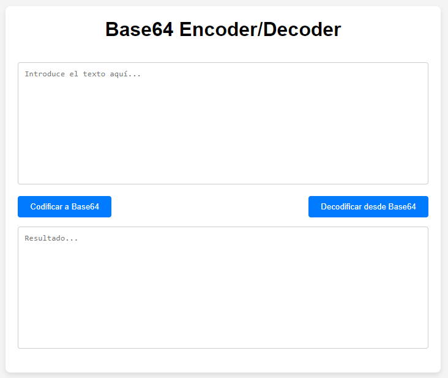

# B64Coder

**B64Coder** es una aplicación web simple que permite codificar y decodificar texto utilizando el formato Base64. Es ideal para desarrolladores o usuarios que necesiten transformar datos entre texto legible y una cadena Base64 de manera rápida y sencilla.

## Características

- Codifica texto en Base64 con un solo clic.
- Decodifica cadenas en Base64 a su texto original.
- Interfaz de usuario limpia y fácil de usar.
- Implementado con HTML, CSS, y JavaScript puro.

## Tecnologías Utilizadas

- **HTML5**: Para la estructura básica de la aplicación.
- **CSS3**: Para la presentación y el diseño de la interfaz.
- **JavaScript**: Para la lógica de codificación y decodificación de Base64.

## Captura de Pantalla

 <!-- Asegúrate de incluir una captura de pantalla del proyecto -->

## Cómo Usar

1. Clona este repositorio:
   ```bash
   git clone https://github.com/tu-usuario/B64Coder.git
   ```
2. Abre el archivo `index.html` en tu navegador.

3. Introduce el texto que deseas codificar o decodificar en el área de texto.

4. Haz clic en los botones:
   - **Codificar a Base64** para convertir tu texto a Base64.
   - **Decodificar desde Base64** para transformar el texto Base64 a su formato original.

## Ejemplo

### Codificación:
- **Entrada**: `Hola Mundo`
- **Salida Base64**: `SG9sYSBNdW5kbw==`

### Decodificación:
- **Entrada**: `SG9sYSBNdW5kbw==`
- **Salida**: `Hola Mundo`

## Estructura del Proyecto

```bash
B64Coder/
│
├── index.html       # Página principal con la interfaz
├── styles.css       # Estilos para la página
├── script.js        # Lógica de codificación y decodificación
├── README.md        # Este archivo
└── screenshot.png   # Captura de pantalla de la aplicación (opcional)
```

## Próximas Funcionalidades

- Soporte para otros tipos de codificaciones.
- Mejoras en la interfaz de usuario con temas claro y oscuro.
- Versión offline usando tecnologías PWA.

## Contribuciones

¡Contribuciones son bienvenidas! Si tienes sugerencias, mejoras o encuentras errores, por favor abre un issue o realiza un pull request.

## Licencia

Este proyecto está licenciado bajo la [Licencia MIT](LICENSE).